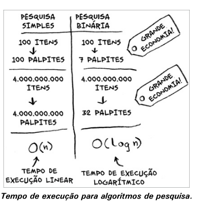
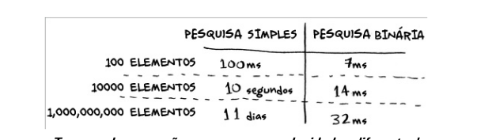
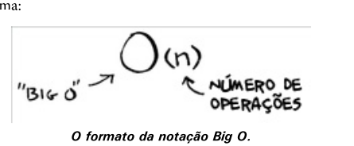
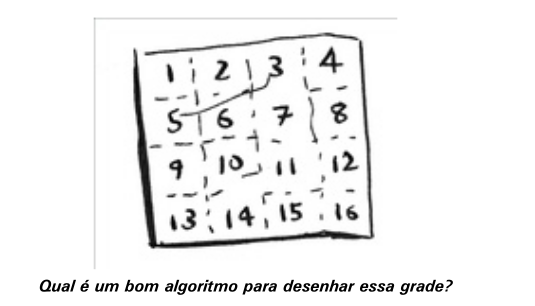
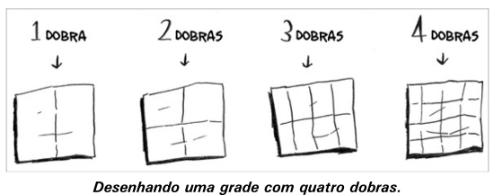
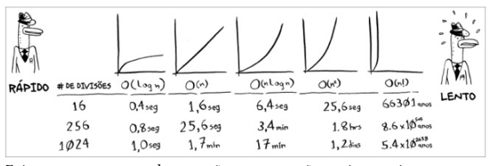
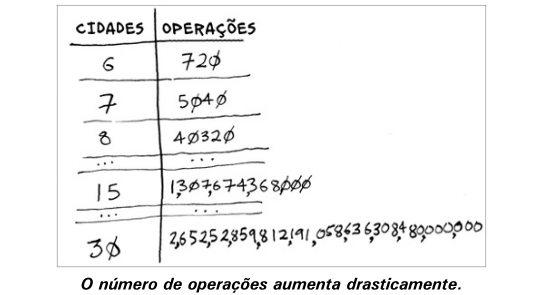

# Pesquisa binária

A pesquisa binária é um algoritmo. Sua entrada é uma lista ordenada de elementos. Se o elemento que você está procurando está na lista, a pesquisa binária retorna a posição dele. Caso contrário, a pesquisa binária retorna `None`.

De modo muito simplificado, a pesquisa binária funciona como um chute inteligente. Como sabemos que a lista está ordenada, podemos chutar pelo meio da lista. A partir dele, podemos chutar novamente, verificando se o valor é igual ao que estamos procurando: se for, encontramos o valor, caso contrário, podemos chutar novamente, mas agora, sabemos se o valor que estamos procurando é maior ou menor que o valor do meio da lista, e assim, podemos chutar novamente, e assim por diante.

A pesquisa binária funciona assim:

1. Compare o elemento do meio da lista com o elemento que você está procurando.
2. Se eles forem iguais, o algoritmo termina.
3. Se o elemento que você está procurando for maior que o elemento do meio, procure na metade direita da lista.
4. Se o elemento que você está procurando for menor que o elemento do meio, procure na metade esquerda da lista.
5. Repita o processo.

A pesquisa binária é muito mais rápida que a pesquisa linear. A pesquisa linear tem uma complexidade de tempo de O(n), enquanto a pesquisa binária tem uma complexidade de tempo de O(log n).

A pesquisa binária só funciona em listas ordenadas.

## Exercícios

1. Suponha que você tenha uma lista de 128 elementos. Qual é o máximo de etapas que a pesquisa binária vai levar?

R: log 128 = 2^7 - 7 etapas

2. Suponha que você tenha uma lista de 1024 elementos. Qual é o máximo de etapas que a pesquisa binária vai levar?

R: log 1024 = 2^10 - 10 etapas

# Tempo de execução

tempo linear, quando precisamos percorrer todos os elementos da lista

tempo logarítmico, quando a lista é dividida pela metade a cada passo

## Notaçao Big O

A notaão Big O é uma notação especial que diz o quão rápido é um algoritimo.

## Tempo de execução dos algoritmos cresce a taxas diferentes

A notação Big O informa o quão rápido é um algoritmo. A notão Big O permite que você compare o número de operações. ela informa o quão rápido o tempo de execução de um algoritmo cresce à medida que o tamanho da entrada aumenta.

## Exemplos

### Grade com 16 quadrados

Big O(n) - tempo linear

### Dobre o papel

Big O(log n) - tempo logarítimico

>A notação Big O estabelece o tempo de execução do pior caso

## Alguns exemplos comuns de tempo de execução Big O

- O(log n) - logarítimico, exemplo: pesquisa binária
- O(n) - linear, exemplo: pesquisa simples
- O(n * log n) - exemplo: algoritmo de ordenação rápido (quick sort)
- O(n^2) - exemplo: algoritmo de ordenação por seleção
- O(n!) - exemplo: um algortimo bastante lento, como o do caixeiro viajante

- a rapidez de um algoritmo é medida em termos de crescimento do tempo de execução à medida que o tamanho da entrada aumenta
- Em vez disso discutimos sobre o quão rapidamente o tempo de execução de um algoritmo aumenta à medida que o tamanho da entrada aumenta
- A notação Big O nos permite comparar o número de operações
- O(log n) é mais rápido do que O(n) e O(log n) fica mais rápido conforme a lista aumenta

## Exercícios

1.3 Você tem um nome e deseja encontrar o número de telefone para esse
nome em uma agenda telefônica.

R: O(log n) - pesquisa binária

1.4 Você tem um número de telefone e deseja encontrar o dono dele em uma agenda telefônica. (Dica: Deve procurar pela agenda inteira!)

R: O(n) - pesquisa linear
1.5 Você quer ler o número de cada pessoa da agenda telefônica.

R: O(n) - pesquisa linear

1.6 Você quer ler os números apenas dos nomes que começam com A. (Isso
é complicado! Esse algoritmo envolve conceitos que são abordados mais
profundamente no Capítulo 4. Leia a resposta – você cará surpreso!)

Resposta: O(n). Você pode pensar: “Só estou fazendo isso para 1 dentre 26
caracteres, portanto o tempo de execução deve ser O(n/26).” Uma regra
simples é a de ignorar números que são somados, subtraídos,
multiplicados ou divididos. Nenhum desses são tempos de execução Big
O: O(n + 26), O(n - 26), O(n * 26), O(n / 26). Eles são todos o mesmo
que O(n)! Por quê? Se você está com dúvidas, vá para “Notação Big O
revisada”, no Capítulo 4, e leia a parte sobre constantes na notação Big O
(uma constante é apenas um número; 26 era a constante desta questão).

## Caixeiro viajante

O problema do caixeiro viajante é um problema clássico. Dado um número de cidades e as distâncias entre elas, o problema é encontrar o caminho mais curto que visita cada cidade uma única vez e retorna à cidade de origem.

> No entanto, uma vez que lidamos com mais de 100 cidades, é impossível calcular a resposta em função do tempo – o sol entrará em colapso antes.

## Resumo

- A pesquisa binária é muito mais rápida do que a pesquisa simples.
- O(log n) é mais rápido do que O(n), e O(log n) fica ainda mais rápido
conforme os elementos da lista aumentam.
- A rapidez de um algoritmo não é medida em segundos.
- O tempo de execução de um algoritmo é medido por meio de seu crescimento.
- O tempo de execução dos algoritmos é expresso na notação Big O.
