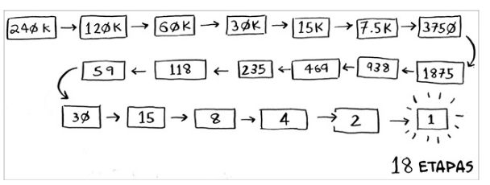

# Pesquisa binária

A pesquisa binária é um algoritmo. Sua entrada é uma lista ordenada de elementos. Se o elemento que você está procurando está na lista, a pesquisa binária retorna a posição dele. Caso contrário, a pesquisa binária retorna `None`.

De modo muito simplificado, a pesquisa binária funciona como um chute inteligente. Como sabemos que a lista está ordenada, podemos chutar pelo meio da lista. A partir dele, podemos chutar novamente, verificando se o valor é igual ao que estamos procurando: se for, encontramos o valor, caso contrário, podemos chutar novamente, mas agora, sabemos se o valor que estamos procurando é maior ou menor que o valor do meio da lista, e assim, podemos chutar novamente, e assim por diante.

A pesquisa binária funciona assim:

1. Compare o elemento do meio da lista com o elemento que você está procurando.
2. Se eles forem iguais, o algoritmo termina.
3. Se o elemento que você está procurando for maior que o elemento do meio, procure na metade direita da lista.
4. Se o elemento que você está procurando for menor que o elemento do meio, procure na metade esquerda da lista.
5. Repita o processo.

A pesquisa binária é muito mais rápida que a pesquisa linear. A pesquisa linear tem uma complexidade de tempo de O(n), enquanto a pesquisa binária tem uma complexidade de tempo de O(log n).

A pesquisa binária só funciona em listas ordenadas.

## Exercícios

1. Suponha que você tenha uma lista de 128 elementos. Qual é o máximo de etapas que a pesquisa binária vai levar?

R: log 128 = 2^7 - 7 etapas

2. Suponha que você tenha uma lista de 1024 elementos. Qual é o máximo de etapas que a pesquisa binária vai levar?

R: log 1024 = 2^10 - 10 etapas
