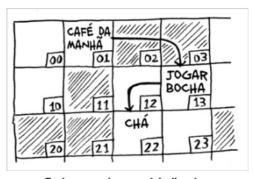
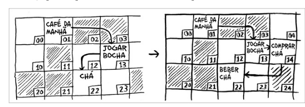
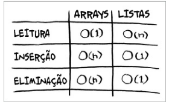
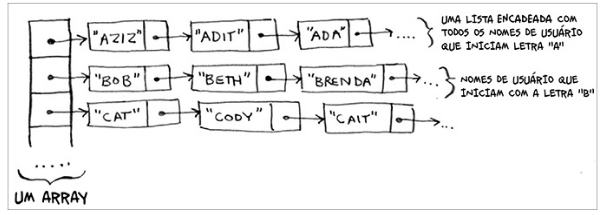
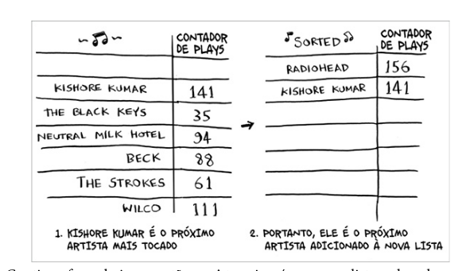

# Array

armazena de modo predeteminado os espaços em memoria de forma sequencial.

*arrays tem acesso aléatorio. pode acessar qual quer elemento quando quiser*

## Desvantagem

- espaço é alocado e fixo, pondendo ter um disperdicio de memoria.
- quando precisa adicionar um novo elemento, é necessario criar um novo array e copiar os elementos do array antigo para o novo array.

# Lista Encadeada

A lista encadeada é uma estrutura de dados que armazena os elementos de forma sequencial, mas não necessariamente em espaços de memoria sequenciais.

Com as listas encadeadas você nunca precisa mover os seus itens.

Lista encadeada não pode ser indexada, para acessar um elemento é necessario percorrer a lista.

*Lista encadeados tem acesso sequencia, precisar pecorre sequencialmente até encontra o elemento*

# Arrays

Com array podemos acessa qualquer elemento em tempo constante, isso se deve ao fato de que os elementos são armazenados em espaços de memoria sequenciais, por isso podemos indexar qualquer elemento em tempo constante.

# Terminologia

tempo de execução para operações comuns de arrays e listas

# Exercicios

Suponha que você esteja criando um aplicativo para acompanhar as suas
nanças.
Todos os dias você anotará tudo o que gastou e onde gastou. No nal do
mês, você deverá revisar os seus gastos e resumir o quanto gastou. Logo,
você terá um monte de inserções e poucas leituras. Você deverá usar um
array ou uma lista para implementar este aplicativo?

R: Lista encadeada

# Inserindo algo no meio da lista

Adicionar elementos no meio em lista encadeadas é muito mais rapido do que em arrays, pois em arrays é necessario mover todos os elementos para a direita. Enquanto no array encadeado é necessario apenas mudar os ponteiros.

# Deleções

deleções em lista encadeadas e bem mais rapido do que em arrays, pois em arrays é necessario mover todos os elementos para a esquerda. Enquanto no array encadeado é necessario apenas mudar os ponteiros.

# Exercicios

2.2 Suponha que você esteja criando um aplicativo para anotar os pedidos
dos clientes em um restaurante. Seu aplicativo precisa de uma lista de
pedidos. Os garçons adicionam os pedidos a essa lista e os chefes retiram
os pedidos da lista. Funciona como uma la. Os garçons colocam os
pedidos no nal da la e os chefes retiram os pedidos do começo dela
para cozinhá-los.
Você usaria um array ou uma lista encadeada para implementar essa lista?
(Dica: listas encadeadas são boas para inserções/eliminações e arrays são
bons para acesso aleatório. O que fazer neste caso?)

R: Lista encadeada

Vamos analisar um experimento. Imagine que o Facebook guarda umalista de usuários. Quando alguém tenta acessar o Facebook, uma busca é
feita pelo nome de usuário. Se o nome da pessoa está na lista, ela pode
continuar o acesso. As pessoas acessam o Facebook com muita
frequência, então existem muitas buscas nessa lista. Presuma que o
Facebook usa a pesquisa binária para procurar um nome na lista. A
pesquisa binária requer acesso aleatório – você precisa ser capaz de
acessar o meio da lista de nomes instantaneamente. Sabendo disso, você
implementaria essa lista como um array ou uma lista encadeada?

R: Array, o requisito e de acesso aleatorio

2.4 As pessoas se inscrevem no Facebook com muita frequência também.
Suponha que você decida usar um array para armazenar a lista de
usuários. Quais as desvantagens de um array em relação às inserções? Em
particular, imagine que você está usando a pesquisa binária para buscar
os logins. O que acontece quando você adiciona novos usuários em um
array?

R: O problema de usar arrays é que eles estão sequencialmente em memoria, nesse caso, a lista pode ser muito grande e precisaria reserva um espaçoo de momoria grande inicialmente, além disso operações de inserção e deleção, movem todos os elementos para a direita ou esquerda, o que pode ser muito custoso.

2.5 Na verdade, o Facebook não usa nem arrays nem listas encadeadas para
armazenar informações. Vamos considerar uma estrutura de dados
híbrida: um array de listas encadeadas. Você tem um array com 26 slots.
Cada slot aponta para uma lista encadeada. Por exemplo, o primeiro slot
do array aponta para uma lista encadeada que contém os usuários que
começam com a letra A. O segundo slot aponta para a lista encadeada
que contém os usuários que começam com a letra B, e assim por diante.
Suponha que o Adit B se inscreva no Facebook e você queira adicioná-lo à
lista. Você vai ao slot 1 do array, a seguir para a lista encadeada do slot 1, e
adiciona Adit B no nal. Agora, suponha que você queira procurar o
Zakhir H. Você vai ao slot 26, que aponta para a lista encadeada de todosos nomes começados em Z. Então, procura pela lista até encontrar o Zakhir H.

Compare esta estrutura híbrida com arrays e listas encadeadas. É mais lento
ou mais rápido fazer inserções e eliminações nesse caso? Você não precisa
responder dando o tempo de execução Big(O), apenas diga se a nova
estrutura de dados é mais rápida ou mais lenta do que os arrays e as listas
encadeadas.

no caso da lista encadeada é indiferente, pois as inserções na lista encadeadas são feita em tempo constante. se consideramos que a estrutura conta com arrays de arrays a estrutura é mais eficiente para fazer inserções, pois ela vai precisar fazer a inserção em somente parte dos itens, mas se consideramos que precisamos usar uma estrura de um array unico, então vai se muito mais lento, pois cada operação de inserção vai ser feita em tempo linear.

# Ordenação por seleção

A ordenação por seleção é um algoritmo de ordenação simples, precisamos de duas listas, uma lista com os elementos desordenados e outra com os elementos ordenados. a cada executação do algoritmo, ele encontra o menor elemento da lista desordenada e adiciona na lista ordenada.

# Resumo

- A memória do seu computador é como um conjunto gigante de gavetas.
- Quando se quer armazenar múltiplos elementos, usa-se um array ou uma
lista.
- No array, todos os elementos são armazenados um ao lado do outro.
- Na lista, os elementos estão espalhados e um elemento armazena o endereço do próximo elemento.
- Arrays permitem leituras rápidas.
- Listas encadeadas permitem rápidas inserções e eliminações.
- Todos os elementos de um array devem ser do mesmo tipo (todos ints,todos doubles, e assim por diante).
