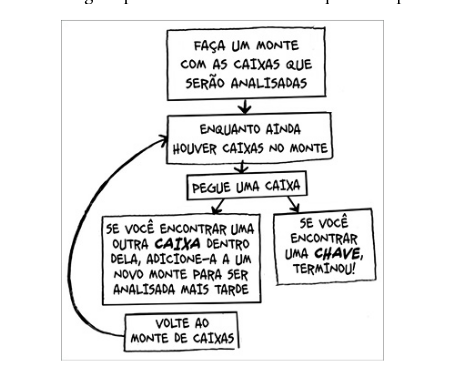

# Agenda

1 - recursão

2- problema do caso base e do caso recursivo

Recursão é uma maneira elegante de resolver problemas


# Recursão

A recursão é usada para tronar a resposta mais clara. abaixo dois exemplos, em termos de desenpenho não faz diferença, loops em algumas situações tentem a ser mais rapidos, mas em termos de clareza a recursão é mais clara.

> Leigh Caldwell, do Stack Overflow, diz "Os loops podem melhorar o desempenho do seu programa . A recursão melhorar o desenpenho do seu progrador. Escolha o que for mais importante para a sua situação."

no caso da recursão o programa é parcialmente completa. A recursão é uma maneira de resolver problemas parcialmente.

## exemplo sem recursão
``` python

def procure_pela_chave(caixa_principal):
	pilha = main_box.crie_uma_pilha_para_busca()
	while pilha is not vazia:
		caixa = pilha.pegue_caixa()
		for item in caixa:
			if item.e_uma_caixa():
				pilha.append(item)
			elif item.e_uma_chave():
			print "achei a chave!"

```

## exemplo com recursão
``` python
def procure_pela_chave(caixa):
	for item in caixa:
		if item.e_uma_caixa():
			procure_pela_chave(item) ## recursão
		elif item.e_uma_chave():
			print "achei a chave!" ## caso base
```


# Caso-base e caso recursivo

Quando escrevemos uma função recursiva devemos informa qual é a codição de parada. Por isso toda função recursiva tem duas parte: o caso base e o caso recursivo.


## Caso base

O caso base é quando a funão não cham a si mesma novamente de forma que o programa não se trona um loop infinito.


``` python

def regressiva(i):
	print i
	if i<= 1: ## caso base
		return
	else: ## caso recursivo
		regressiva(i-1)

```


# Pilha (call stack)


# abordagens

abordagem sem recursão para remover caixas :



abordagem com recursão para remover caixas :


Utilizar a pilha é conveniente por que você não precisa acompanha o monte de caixas - pilha faz isso para vocẽ. Usar a piha é bom, porém, existe um custo: salva toda essa informação pode ocupar muita memória. Cada uma desta funões de chamada ocupa um pouco de memória, e quando a sua pilha es´ta cheia é sinal de que seu computada está salvando informações para muitas chamadas de funções . Nesse caso existe duas opções

- rescrever usando loop
- utilizar o que chamamos de tail recursion. Isto é um tópico avançãdo e está fora do escopo deste livro. Esta técnica também não suportada por todas as linguagens de programação.

# Resumo

- Recursão é quando uma funão chama a si mesma.
- Toda funão recrsiva tem dois caso : caso-base e o caso recursivo.
- todas as chamada de funão vão para a pilha de chamadas.
- A pilha de chamda pode fica muito grande e ocupar muita memória.
