# Neste caítulo

- tecnica de dividir para conquistar
- Quicksort, algoritimo de ordenação

# Dividir para conquistar

1 - Descubra o caso-base, que deve ser o caso mais simples possível
2 - divida ou diminua o seu problema até que ele se torne o caso-base

## O algoritimo para achar o quadrado de uma fazenda

### euristica simples

1 - primeiro, fazemos dividimos a fazenda para cria os dois maior quadrados possiveis
2 - verificamos se houve restos, se houve dividimos o resto até que não haja mais restos

Assim o caso-base é quando não houver mais restos

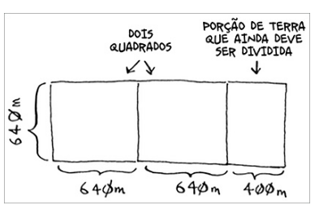

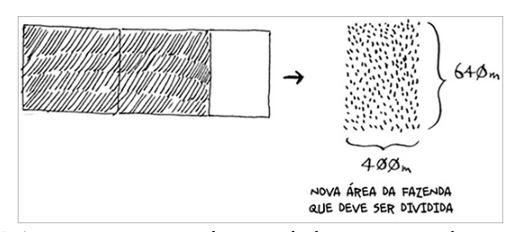

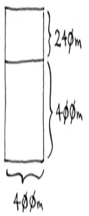

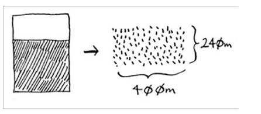

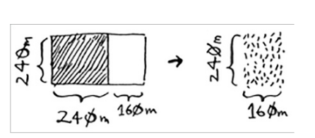

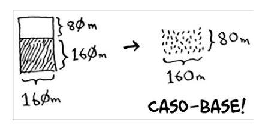

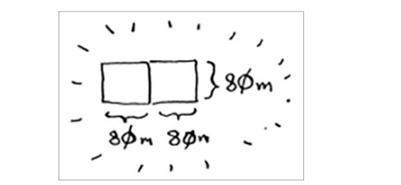

## soma lista recursiva

O caso-base é quando a lista estiver vazia retornamos 0

 

 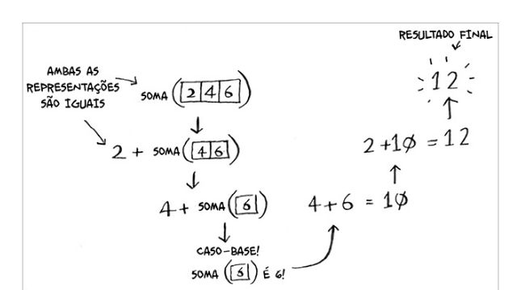

 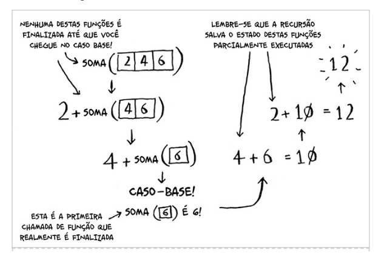

 # Quicksort

 O quicksort é um algoritmo de ordenação e é muito muito mais rápido do que a ordenação por seleção e é muito utilizado na prática.

 sempre que utilizamos o DC, temos que pensar em duas coisas:

 1 - o caso base (qual o caso mais simples que podemos resolver)
 2 - como reduzir o problema

 no caso da ordenação é o array vazio ou o array com um elemento

 caso base
 

 ## Quicksort

 1 - escolha um elemento do array para ser o pivô
 2 - particione o array em dois subaarays, sperando-os entre elementos menores do que o pivê e elementos maiores do que o pivô
 3 - execute o quicksort recursivamente em mabos os subarrays

 exemplo utiizando um array de 5 elementos, utilizando o 3 como pivô

 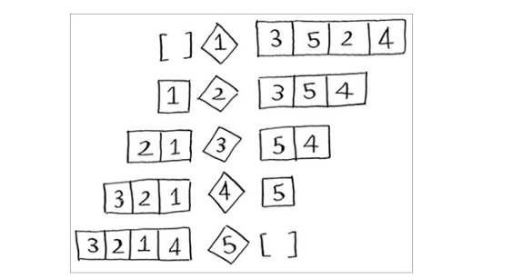

 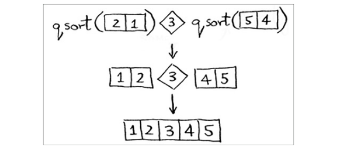

# Notação Big O revisada

O algoritmo de quicksort é único , pos usa velocidade depende do pivô escolhido.

revisão dos tempos de execução

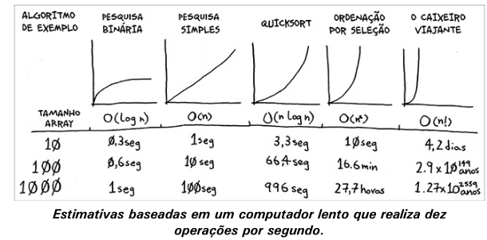

O algoritmo do quicksort no pior dos casos tem o tempo de execução de O(n^2), o que bastante lento. Mas no caso médio, o tempo de execução é O(n log n),

## Merge sor versus quicksort

O quicksort tem uma constante menor do que o merge sort, por isso ele é mais rápido. mesmo que o merge sort tenha um tempo de execução O(n log n) garantido, e o quicksort no pior dos casos seja O(n^2), o quicksort é mais rápido na prática.

# Caso medio do quicksort

O caso médio do quick sort depende bastante da escolha od pivô.
suponha que escolhemos o primeiro elemento e o array ja está ordenado, como o quicksort não validar se o array ja está ordenado o tempo de execução vai ser O(n^2). além disso a pilha de chamadas vai ser muito grande

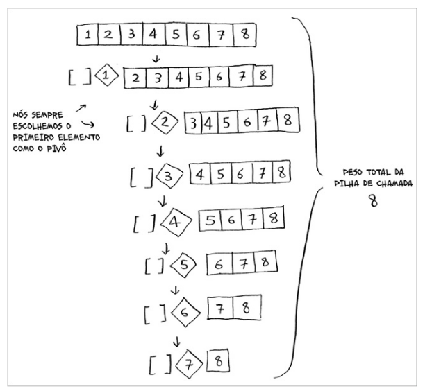

Agora vamos supor que escolhemos o elemento central, o tempo de execução vai ser O(n log n) e a pilha de chamadas vai ser menor.

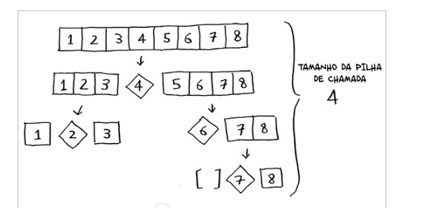

o tempo de execução do algoritmo vai ser o numer de niveis multiplicado pelo tempo de execução de cada nivel.

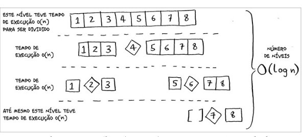

O(n) * O(log n) = O(n log n)

# Exercícios

4.5 Imprimir o valor de cada elemento em um array.

R: O(n)

Explicação:
Para imprimir cada elemento de um array, você precisa percorrer todos os elementos uma vez.

Se o array tem n elementos, você fará n operações (uma para cada elemento).

Portanto, a complexidade é O(n), onde n é o tamanho do array.

4.6 Duplicar o valor de cada elemento em um array.

R: O(n)

Explicação:
Para duplicar o valor de cada elemento, você precisa percorrer todos os elementos do array uma vez e realizar uma operação de multiplicação para cada um.

Se o array tem n elementos, você fará n operações.

Portanto, a complexidade é O(n).

4.7 Duplicar o valor apenas do primeiro elemento do array.
	como o primeiro elemento é constante, o tempo de execução é constante
	O(1)

Explicação:
	Aqui, você só precisa acessar o primeiro elemento do array e multiplicá-lo por 2.

	Não importa o tamanho do array (n), pois você está realizando uma única operação.

	Portanto, a complexidade é O(1), que representa tempo constante.

4.8 Criar uma tabela de multiplicação com todos os elementos do array.
Assim, caso o seu array seja [2, 3, 7, 8, 10], você primeiro multiplicará
cada elemento por 2. Depois, multiplicará cada elemento por 3 e então
por 7, e assim por diante.
R: O(n!)

Explicação:
Para criar uma tabela de multiplicação, você precisa multiplicar cada elemento do array por todos os outros elementos (incluindo ele mesmo).

Se o array tem n elementos, você fará n * n = n² operações.

Portanto, a complexidade é O(n²).

# Resumo

- A estratégia DC funciona por meio da divisão do problema em problemas menores. Se vocẽ estiver utilizando DC em uma lista, o caso-base provavelmente será uma lista vazia ou com apenas um elemento
- se você esive implementado o quicksort, escolha um elemento aleatório como pivô para garantir que o tempo de execução seja O(n log n) no caso médio.
- A constante, na notação Big O, pode ser relevante em alguns casos. Esta é
a razão pela qual o quicksort é mais rápido do que o merge sort.
- A constante di cilmente será relevante na comparação entre pesquisa
simples e pesquisa binária, pois O(log n) é muito mais rápido do que O(n)
quando sua lista é grande.
