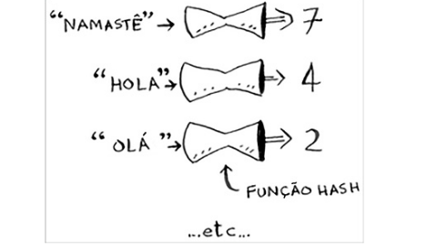
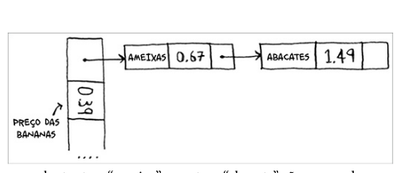
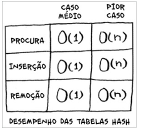
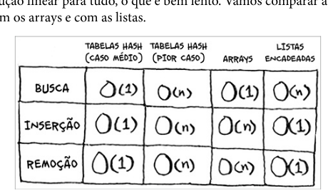
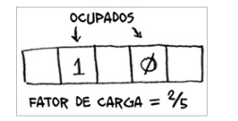
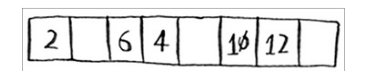
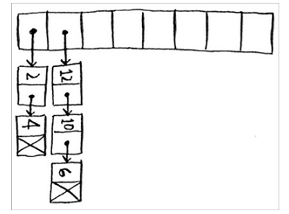

- Você conhecerá as tabelas hash, uma estrutura de dados básica
- detalhes e implementação

# Funções hash

Uma funão hash é uma funão na qual você insere um string e, depois disso, a função retrona um número

# Exemplos de utilização

- resolução de dns

# Evitando entradas duplicadas

# Colisões de hash

- podemos implementa uma estrutura de hash como se você um array de listas encadeadas, aonde cada cada index do array é uma letra do alfabeto e cada lista encadeada é uma palavra que começa com a letra do index.

# Performace

# Fator de carga

As tabelas has utilizam um array para armazenar , então se deve contar o numero de espaços disponiveis no array, e os espaços ocupados, para calcular o fator de carga, que é a razão entre os espaços ocupados e os espaços disponiveis.

quando o fator de carga menor que um indica que tabela hash tem espaço suficiente para armazenar os elementos, quando o fator de carga é maior que um indica que a tabela hash está cheia e é necessario aumentar o tamanho do array.

geralmente o fator de carga é mantido em 0.7.

# Função de hash

- uma boa funão de hash destribui os elementos de forma uniforme pelo array, evitando colisões.

sem colisão

com colisão

# Resumo

- Você pode fazer uma tabela hash ao combinar uma função hash com um
array.
- Colisões são problemas. É necessário haver uma função hash que
minimize colisões.
- As tabelas hash são extremamente rápidas para pesquisar, inserir e
remover itens.
- Tabelas hash são boas para modelar relações entre dois itens.
- Se o seu fator de carga for maior que 0,7, será necessário redimensionar a
sua tabela hash.
- As tabelas hash são utilizadas como cache de dados (como em um
servidor da web, por exemplo).
- Tabelas hash são ótimas para localizar duplicatas.

