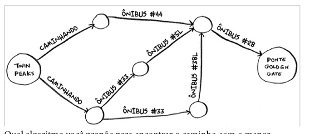
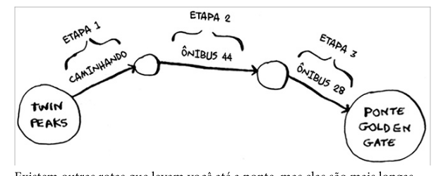
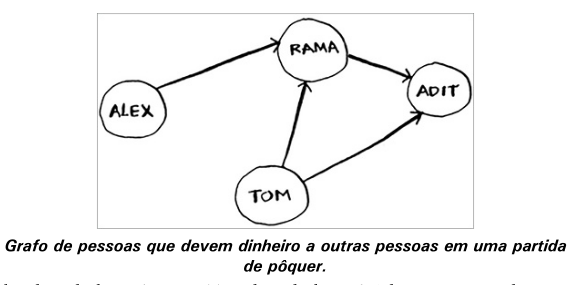
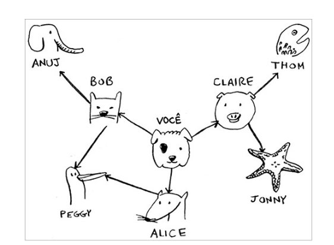

# Pesquisa emlargura

- grafos
- pesquisa em largura
- grafos direcionados e não direcionados
- ordenação topológica

A pesquisa em largura permite enconra o menor caminho entre dois objetos.

# Introdução a grafos

problema para encontra o menor caminho exemplo. No caso abaixo temos que encontra o caminho mais curto entre twin peaks e a golden gate.

passo para resolver o problema utilizando grafo

1 - modele o problema para utilizar grafo
2 - resolva o problema utilizando pesquisa em largura

# Grafos

Grafos são formados por vérticies e arestas, e um vértice pode ser direteamente conectado a muitos outros vértices, por isso chamamos de  vizinhos.

Os grafos são uma maneira de modelar como eventos diferentes estão conectados entre si. Agora vamos ver a pesquisa em largura na prática.

# Pesquisa em largura

O algoritimo ajuda a responde a duis tipos de pergunta:

- Existe algum caminho do vértice A até o vértice B ?
- Qual é o caminho mais curto do vértice A até o vértice B ?

Um bom exemplo de aplicação de grafos, pode ser uma lista de amigos no facebook, onde você pode encontra um produto, no final vamos ter uma rede de amigos que estão conectados a você.

# Encontrado o caminho mínimo

existe duas peguntas que devemos responder

- Exste um caminho do vértice A até o vértice B (Existe um vendedor de manga na minha rede de amigos ?)
- Qual o caminho mínimo do vértice A até o vértice B (Quem é vededor de manga mais próximo de mim ?)

conexões diretas são chamadas conexões de primeiro grau, conforme aumentamos o grau, a conexão fica mais distante.

O algoritmo de pesquisa em largura é um algoritmo de busca que encontra o caminho mais curto entre dois vértices.

# Filas (Estrutura FIFO - First In, First Out)

# grafos

Assim , uma ordenação topológica do grafo poderia ser feita e dessa forma,uma lista de tarefas já em ordem seria elaborada.

# Resumo

- A pesquisa em Largura lhe diz se há um caminho A para B
- Se esse caminho existir, a pesquisa em largura lhe dará o caminho mínimo
- se você tem um porblema do tipo "encontre o meno X", tente modela o seu problema utilizando grafos e use a pesquisa em largura pra resolvê-lo
- um dígrafo contém seta e as relações seguem a direção das setas
- Grafos não direcionados não contêm setas, e a relação acontece nos dois sentidos
- Filas são FIFO (primeiro a entrar, primeiro a sair)
- Pilhas são LIFO (último a entrar, primeiro a sair).
- Você precisa veri car as pessoas na ordem em que elas foram adicionadas à lista de pesquisa. Portanto a lista de pesquisa deve ser uma la; caso contrário, você não obterá o caminho mínimo.
- Cada vez que você precisar veri car alguém, procure não vericá-lo novamente. Caso contrário, poderá acabar em um loop in nito.

