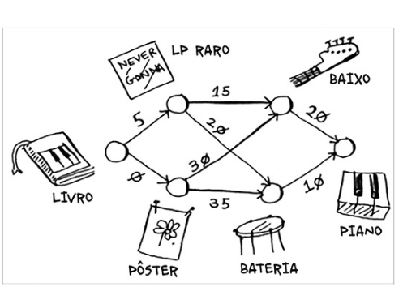
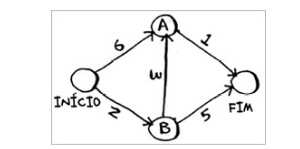
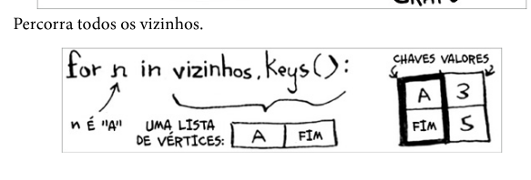
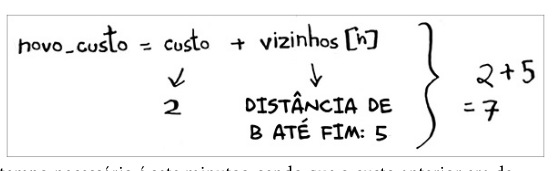
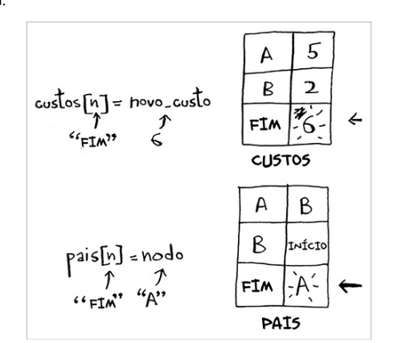

# Algoritmo de Dijkstra

Utilizamos dijkstra em grafos aonde temos um grafo direcionado e ponderado, onde as arestas tem um peso.Dijkstra é um algoritmo de que encontra o caminho mais rapido, enquanto o algoritmo de pesquisa em largura encontra o caminho mais curto(com a menor quantidade de arestas).

# Trabalhando com o algoritmo de Dijkstra

Cada segmento tem um tempo de deslocamente em minutos. Você usará o algoritmo de Dijkstra para ir do inicio ao fim no meno tempo possível.

- Encontre o vértice mais "barato". Esse é o vértice em que você consegue chegar no menor tempo possível.
- Verifique se há um caminho mais barato para os vizinhos desse vértice. Caso exista, atulaize os custos deles.
- Repita até que você tenha feito isso para cada vértice do grafo.
- Calcule o caminho final

Terminologia

para calcular o caminho em um grafo não ponderado utilizar a busca em profundidade. Em grafos ponderados utilizar o algoritmo de Dijkstra.

O algoritmo de Dijkstra só funciona com grafos acíclicos dirigidos.

# Aresta com pesos negativos

Você não utilizo o algoritmo de Dijkstra se estive com arestas com pesos negativos

# Implementação do algoritmo de Dijkstra

A implementação do algoritmo de distra precisamos de tres tabelas hash:

- grafo (o grafo vai ser uma tabela hash de grafos)
- custos
- pais

1. - Encontra o custo mais baixo que ainda não foi precessado
2. - Caso todos os vértices tenha sido precessados, esse laço while será finalizado
3. - precorre todos os vizinho desse vértice
4. - Caso seja mais barato cheagar a um vizinho a partir desse vertice
5. - atualizar o custo deles
6. - esse vértice ser torna o novo pai para o vizinho
7. - Marca o vértice como processado
8. - Encontra o próximo vértice para processar e repete o processo

# Exemplo prático

Algoritimo passa a passo :

# Exemplo IA

# Algoritmo de Dijkstra

O algoritmo de Dijkstra é um método para encontrar o caminho mais curto entre nós em um grafo. Ele foi criado pelo cientista da computação holandês Edsger W. Dijkstra em 1956 e é amplamente utilizado em roteamento de redes, mapas digitais e outras aplicações.

## Como funciona o algoritmo:

1. Atribui-se valor zero ao nó inicial e infinito aos demais nós
2. Marca-se o nó inicial como atual
3. Para o nó atual, consideram-se todos os seus vizinhos não visitados e calculam-se suas distâncias
4. Após avaliar todos os vizinhos, marca-se o nó atual como visitado
5. Seleciona-se o nó não visitado com menor distância como próximo nó atual
6. Repete-se os passos 3-5 até que o nó de destino seja marcado como visitado

## Exemplo prático:

Vamos considerar um grafo com 6 nós (A, B, C, D, E, F) com as seguintes arestas e pesos:

- A → B: 2
- A → C: 4
- B → C: 1
- B → D: 7
- C → D: 3
- C → E: 5
- D → E: 1
- D → F: 4
- E → F: 2

Queremos encontrar o caminho mais curto de A para F.

### Passo a passo:

1. Inicialização:
   - Distância para A = 0
   - Distância para B, C, D, E, F = infinito
   - Nós visitados = {}
   - Nó atual = A

2. A partir de A:
   - Atualiza distância de B: 0 + 2 = 2
   - Atualiza distância de C: 0 + 4 = 4
   - Marca A como visitado
   - Nós visitados = {A}
   - Próximo nó atual = B (menor distância não visitada)

3. A partir de B:
   - Atualiza distância de C: min(4, 2 + 1) = 3
   - Atualiza distância de D: min(∞, 2 + 7) = 9
   - Marca B como visitado
   - Nós visitados = {A, B}
   - Próximo nó atual = C (menor distância não visitada)

4. A partir de C:
   - Atualiza distância de D: min(9, 3 + 3) = 6
   - Atualiza distância de E: min(∞, 3 + 5) = 8
   - Marca C como visitado
   - Nós visitados = {A, B, C}
   - Próximo nó atual = D (menor distância não visitada)

5. A partir de D:
   - Atualiza distância de E: min(8, 6 + 1) = 7
   - Atualiza distância de F: min(∞, 6 + 4) = 10
   - Marca D como visitado
   - Nós visitados = {A, B, C, D}
   - Próximo nó atual = E (menor distância não visitada)

6. A partir de E:
   - Atualiza distância de F: min(10, 7 + 2) = 9
   - Marca E como visitado
   - Nós visitados = {A, B, C, D, E}
   - Próximo nó atual = F (menor distância não visitada)

7. Marca F como visitado e o algoritmo termina.

### Resultado:
- Caminho mais curto de A para F tem comprimento 9
- O caminho é: A → B → C → D → E → F

Este exemplo mostra como o algoritmo de Dijkstra explora progressivamente o grafo para encontrar o caminho mais curto, sempre escolhendo o nó não visitado com a menor distância atual.

