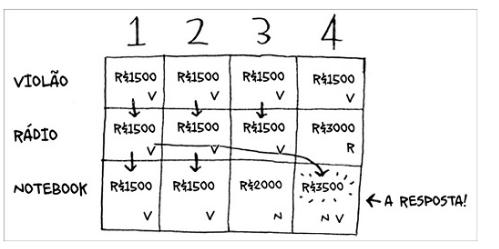

# Algoratimos gulosos

# Problema do cronograma da sala de aula

1. Pegue a aula que termina mais cedo. Esta é a primeira aula que você
colocará nessa sala.
2. Agora você precisa pegar uma aula que comece depois da primeira aula.
De novo, pegue a aula que termine mais cedo. Esta é a segunda aula que
você colocará


Um algoritmo guloso é simples: a cada etapa, deve-se escolher o movimento ideal.

# O problema da mochila

1. Pegue o item mais caro que caiba na sua mochila.
2. Pegue o próximo item mais caro que caiba na sua mochila, e assim por
diante.


nem sempre a estratégia gulosa funciona.No caso acima o item mais caro não é o melhor item a ser colocado na mochila, pois se escolher os outros dois itens, o valor total seria maior.

O algoritmo guloso resolver o problema de uma maneira muito boa. Geralmente, eles são simples e chegam bem perto da solução perfeita

# O problema da cobertura de consuntos




1. Liste cada subconjunto possível de estações. Isso é chamado de conjunto
de partes (também conhecido como conjunto de potência). Neste caso,
existem 2^n possíveis conjuntos.

2. Entre eles, escolha o conjunto com o menor número de estações que
abranja todos os cinquenta estados.


## Algoritmos de aproximação

1. Pegue a estação que abranja o maior número de estados que ainda não
foram cobertos. Tudo bem se a estação abranger alguns estados que já foram cobertos.
2. Repita isso até que todos os estados tenham sido cobertos.

saimos de um porblema O(2^n) para um problema O(n^2)

``` python

while estados_abranger:
	melhor_estacao = None
	estados_cobertos = set()
	for estacao, estados in estacoes.items():
		cobertos = estados_abranger & estados
			if len(cobertos) > len(estados_cobertos):
			melhor_estacao = estacao
			estados_cobertos = cobertos
estados_abranger -= estados_cobertos
estacoes_finais.add(melhor_estacao)

```


no caso do exemplo acima, ele sempre pegar a melhor estação, e remover ela da lista de estados, até que todos os estados sejam cobertos.


O problema do caxeiro viajante e da cobetura de conjuntos podem ser resolvido com algoritmos de aproximação (algoritmos gulosos).


# Resumo

- Algoritmos gulosos otimizam localmente na esperança de acabar em uma
otimização global.
- Problemas NP-completo não têm uma solução rápida.
- Se você estiver tentando resolver um problema NP-completo, o melhor a
fazer é usar um algoritmo de aproximação.
- Algoritmos gulosos são fáceis de escrever e têm tempo de execução baixo,
portanto eles são bons algoritmos de aproximação.
