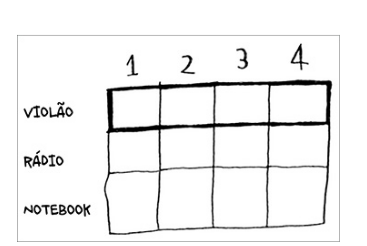
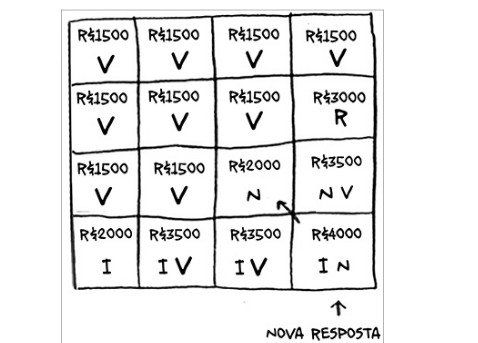

# O problema da mochila

A programção dinamica inicia com problemas menores e os resolve até chagar ao prblema geral.

o problema parte do principio que existe um tabela de itens, as linhas são os itens e as colunas são o peso da mochila.



queremos saber o valor maximo que podemos colocar na mochila.

para isso vamos obter o valor maximo para cada item e cada peso da mochila.

## violão


## radio


## Notebook


partimos do problema com o peso 1 e vamos até o peso 4. quando chegamos no peso 4, temos o maior item que é o nootbook com o valor de 2000 e ainda temos 1kg de espaço, como ja temos calculado o valor maximo para 1kg de espaço.


## Adicionando mais um item

um applephone com peso 1 e valor 2000




## alterando as ordens dos itens

A resposta é a mesma


## Você consegue roubar frações de um item?

A programação dinamica não funciona com frações de itens

para resolver frações de item podemos utilizar o algoritmo guloso.

## Otimizando o seu itinerário de viagem


## Lidando com itens co interdependência


Programação dinâmica é uma ferramenta poderosa para resolver subproblemas utilizando estas resposta para resolver um problema geral. Porém a programação dinâmica só funciona quando os seus subproblemas são discretos, ou seja, quando eles não dependem uns dos outros.


## Programação dinamica

Podemos associar a programação dinamica com a ideia da mochila, e uma boa analogia para tentar modelar o problema.

## Maior substring comum

- Programação dinâmica é útil quando você está tentado otimizar em relação a um limite.
- Você pode utilizar a programação dinãmica quando o problema puder ser separado em subproblemas discretos que não dependam um do outro.

- Toda soluçã de programação dinâmica envolve uma tabela.
- Os valores nas células da mochila, os valores nas céluas eram os valores dos item
- Cada célua e um subproblema, portanto, pense em como você pode divi-lo em outros subproblemas, pois isso lhe ajudará a descobrir quais são os seus eixos

podemos modelar o problema para fazer uma validação de letras em comum entre duas strings.


## Maior subssquencia


``` python
if palavra_a[i] == palavra_b[j]: ❶
	celula[i][j] = celula[i-1][j-1] + 1
else: ❷
	celula[i][j] = max(celula[i-1][j], celula[i][j-1])
```

## Resumo

- A programação dinâmica é útil quando você está tentando otimizar algo
em relação a um limite.
- Você pode utilizar a programação dinâmica quando o problema puder ser
dividido em subproblemas discretos.
- Todas as soluções em programação dinâmica envolvem uma tabela.
- Os valores nas células são, geralmente, o que você está tentando otimizar.
- Cada célula é um subproblema, então pense sobre como é possível dividir
este subproblema em outros subproblemas.
- Não existe uma fórmula única para calcular uma solução em
programação dinâmica.
