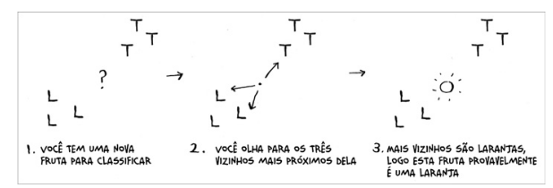
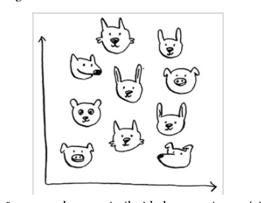
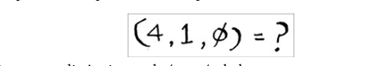

# Knn

O algoritmo usa os vizinhos mais proximo para classificar um novo ponto.

# Criand um sistema de recomendações

# Extração de características

temos que modelar o problema de forma que o algoritmo possa entender.

precisamos consiguir plotar os dados em um grafico.

Assim consiguiriamos calcular a distancia entre os pontos.

Se estivemos um conjunto de dados podemos usar a formular para calcular a distancia entre os pontos.

Distancia entre Priyanka e Justin

# Regressão

Adivinha uma resposta

## Venda de paes

queremos calcular :

fazendo o calculo da distancia temos a tabela abaixo :

agora bastar tirar a media dos valores proximos que temos uma estimativa de quanto de pao vamos vender 218,75..

# Escolhendo boas caracteristicas

Ao trabalhar com o algoritmo dos k-vizinhos mais próximos, é muito importante escolher as características crtas a serem comparadas

- características diretamente correlacionadas
- características imparciasis

Quando o assunto é escolher boas características, não existe apenas uma resposta correta, pois é preciso pensar sobre todos os diferetnes aspectos que devem ser considerados.

# Introdução ao aprendizadode máquina

## OCR - reconhecimento óptico de caracteres

Com o OCR é possível fotografar um texto fazendo com que o seu computador leia este texto a partir da imagem.

1. Percorra diversas imagens de números e extraia as características de cada
um deles.
2. Quando obtiver uma nova imagem, extraia as características

A primeira etapa do OCR, onde você percorre todas as imagens de números e extrai as características.

## Criando um filtro de span

Os filtros de span utilizam outro algoritmo simples chamado de Naive Bayes.

- Naive Bayes é rápido e baseado em probabilidades, mas assume independência entre características.

- k-NN é baseado em distância e não faz suposições sobre os dados, mas pode ser computacionalmente caro.

## Resumo

-  O algoritmo dos k-vizinhos mais próximos é utilizado na classicação e
também na regressão. Ele envolve observar os K-vizinhos mais próximos.
- Classicação = classicar em grupos.
- Regressão = adivinhar uma resposta (como um número).
- Extrair características signica converter um item (como uma fruta ou
um usuário) em uma lista de números que podem ser comparados.
- Escolher boas características é uma parte importante para que um
algoritmo dos k-vizinhos mais próximos opere corretamente.
