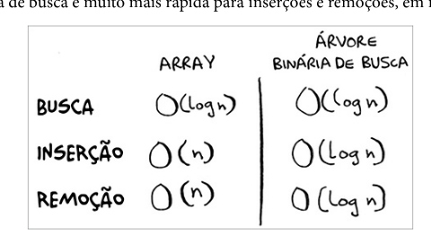

# Arvores

## Árvores Binárias

### Desvantagens

- não é possível ter acesso aleatório aos elementos
- a arvore precisar está baleanceada para ter um bom desempenho

Existem arvores que se auto balanceiam, como a arvore AVL e a arvore rubro-negra.

## Estrutura de dados mais avançadas

- Árvores B
- Árvores rubro-negras
- heaps
- Árvores splay

## Índices invertidos

Uma has que mapeia palavras para lugares onde elas aparecem, muito utilizada em ferramentas de busca.

## Transformada de Fourier

A transformada de Fourier é uma ótima ferramenta par o processsamente de sinais.

## Algoritmos paralelos

Algoritmos paralelos são difíceis de projeta, além de ser difícil fazer com que funcionem corretamente.

- Gerenciamento do paralelismo
- Balanceamento de carga

### MapReduce

### Algortmos Sha

